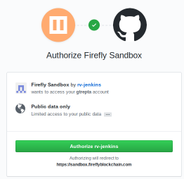
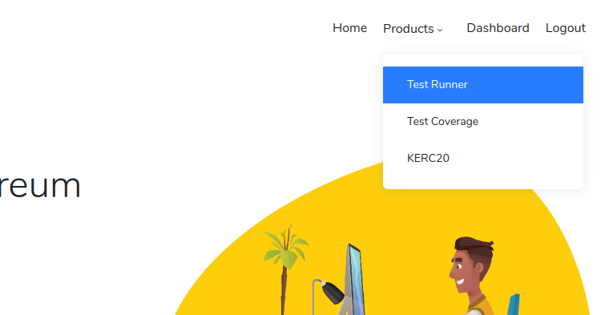
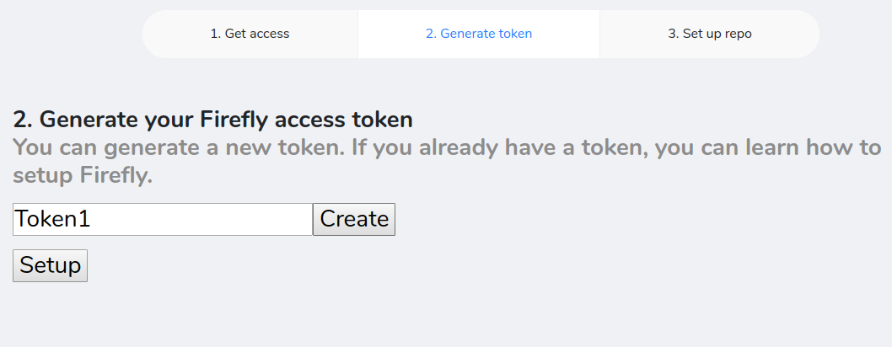
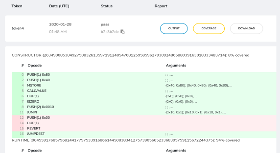

## Authorize Github

-   Go to sandbox.fireflyblockchain.com
-   At the top right, click on "login"
-   At the Github OAuth screen, click on the "Authorize rv-jenkins" button



## Set up an access token

-   After being redirected, go to the "Products" drop-down in the top right and click on "test runner"



-   Click on the "install now" button at the new page
-   Type in a name for your new token and click on "create"



-   Save the token for later

## Set up CI Dependencies

Install system dependencies:

```sh
sudo apt install --yes             \
        autoconf                   \
        bison                      \
        clang-8                    \
        cmake                      \
        curl                       \
        flex                       \
        gcc                        \
        git                        \
        jq                         \
        libboost-test-dev          \
        libcrypto++-dev            \
        libffi-dev                 \
        libgflags-dev              \
        libjemalloc-dev            \
        libmpfr-dev                \
        libprocps-dev              \
        libsecp256k1-dev           \
        libssl-dev                 \
        libtool                    \
        libyaml-dev                \
        lld-8                      \
        llvm-8-tools               \
        make                       \
        maven                      \
        netcat-openbsd             \
        openjdk-11-jdk             \
        pandoc                     \
        pkg-config                 \
        python3                    \
        rapidjson-dev              \
        software-properties-common \
        zip                        \
        zlib1g-dev
```

Install `z3` (>= 4.6.0):

```sh
git clone 'https://github.com/z3prover/z3' --branch=z3-4.6.0
cd z3
python scripts/mk_make.py
cd build
make -j8
sudo make install
cd ../..
rm -rf z3
```

Install `solc`:

```sh
sudo add-apt-repository ppa:ethereum/ethereum
sudo apt-get update
sudo apt-get install --yes solc
```

Install `nodejs` (>= 10.0.0):

```sh
curl -sL https://deb.nodesource.com/setup_10.x | bash -
apt-get install --yes nodejs
```

## Build Firefly

As part of your CI job, make sure to clone and build Firefly:

```sh
curl --location --output k.tar.gz 'https://github.com/kframework/k/releases/download/v5.0.0-9985955/k-nightly.tar.gz'
tar --verbose --extract --file k.tar.gz
export K_RELEASE=$(pwd)/k

git clone https://github.com/kframework/evm-semantics.git
cd evm-semantics
git submodule update --init --recursive -- deps/plugin
make build-web3
cd ..
```

## Run Firefly

Zip up your compiled Solidity contracts.
They exist under the `build` directory in this example (where `truffle compile` places them).

```sh
truffle compile
zip compiled.zip -r build/
```

Launch the Firefly client (we use port 8545 in this example):

```sh
cd evm-semantics
./kevm web3-ganache 8545 --shutdownable &
cd ..
```

Run the test suite that will talk to the Firefly client (ie. Truffle), saving the output:

```sh
truffle test &> results.txt
```

Retrieve the coverage data from Firefly and then close the client:

```sh
cd evm-semantics
./kevm web3-send 8545 firefly_getCoverageData &> ../coverage.json
./kevm web3-send 8545 firefly_shutdown
cd ..
```

Upload gathered data to the Firefly server for post-processing:

```sh
curl -X POST -F access-token="<YOUR_ACCESS_TOKEN>"                                   \
             -F 'status=pass'                                                        \
             -F 'file=@report.txt'                                                   \
             -F 'file2=@coverage.json'                                               \
             -F 'file3=@compiled.zip' 'https://sandbox.fireflyblockchain.com/report'
```

## View the report

-   Go back to sandbox.fireflyblockchain.com
-   In the upper right corner click on "Dashboard"
-   You will be shown a list of reports that have come back from CI. You can click on "Coverage" to view the coverage report


